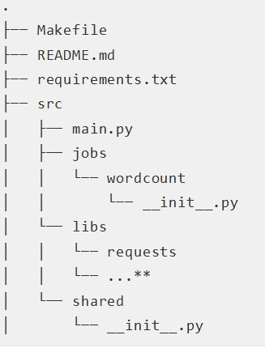

# UI Data Processing

This repository contains PySpark jobs for processing UI data, including security events (SEVs) and event logs.

## Repository Structure



Our repository follows the structure recommended in the [Best Practices for Writing Production-Grade PySpark Jobs](https://developerzen.com/best-practices-writing-production-grade-pyspark-jobs/) article.

Key components:
- `src/`: Contains the source code for our PySpark jobs
   - `jobs/`: Individual job modules
   - `shared/`: Shared utilities and data access layer
  - `main.py`: Entry point for our jobs
- `configs/`: Configuration files
- `jars/`: External Java dependencies
- `tests/`: Unit and integration tests
- `setup.py`: Package and distribution configuration
- `requirements.txt`: Python dependencies

## Setup

1. Clone the repository:
   ```
   git clone [repository_url]
   cd ui_data_processing
   ```

2. Set up a virtual environment:
   ```
   python -m venv venv
   source venv/bin/activate  # On Windows, use `venv\Scripts\activate`
   ```

3. Install dependencies:
   ```
   pip install -r requirements.txt
   ```

4. Build the wheel file:
   ```
   pip wheel . -w dist/
   ```

5. Upload the wheel file to S3:
   ```
   aws s3 cp ./dist/ui_data_processing-0.1.0-py3-none-any.whl s3://aws-emr-studio-381492251123-eu-central-1/spark_jobs/
   ```

## Submitting Jobs

To submit a job to EMR, use the AWS CLI:

1. For the SEVs job:
   ```
   aws emr add-steps --cluster-id j-XXXXXXXXXXXXX --steps file://submit/submit_sevs_job.json
   ```

2. For the Event Logs job:
   ```
   aws emr add-steps --cluster-id j-XXXXXXXXXXXXX --steps file://submit/submit_event_logs_job.json
   ```

Replace `j-XXXXXXXXXXXXX` with your actual EMR cluster ID.

The JSON files in the `submit/` directory contain the necessary configurations for each job, including the S3 path to the wheel file and the entry point to run.

## Development

When making changes:
1. Update the code in the `src/` directory
2. Run tests: `python -m pytest tests/`
3. Rebuild the wheel file: `pip wheel . -w dist/`
4. Upload the new wheel file to S3
5. Submit the job to test on EMR